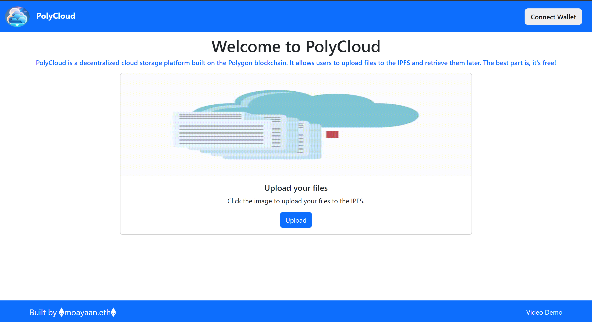
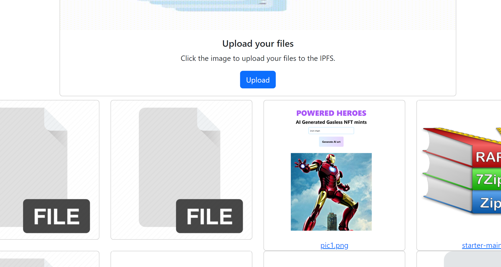
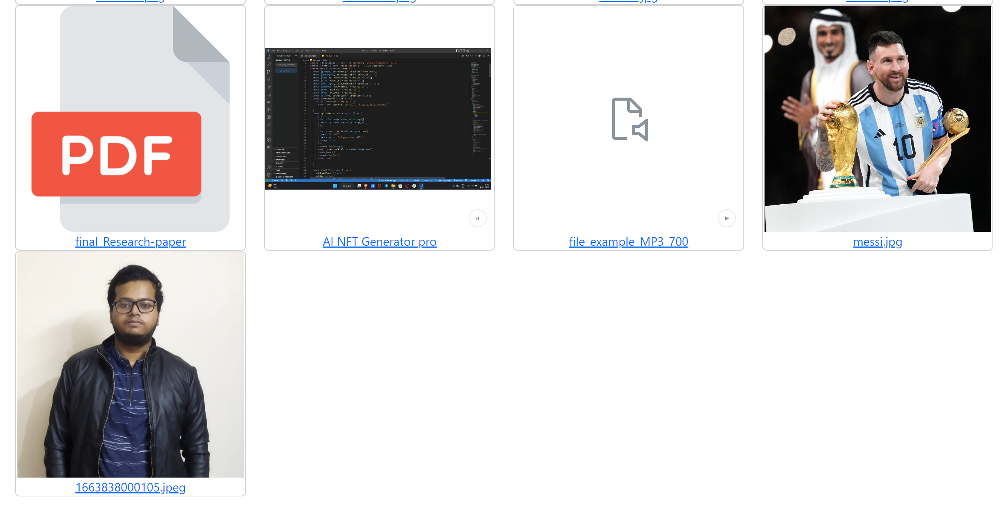
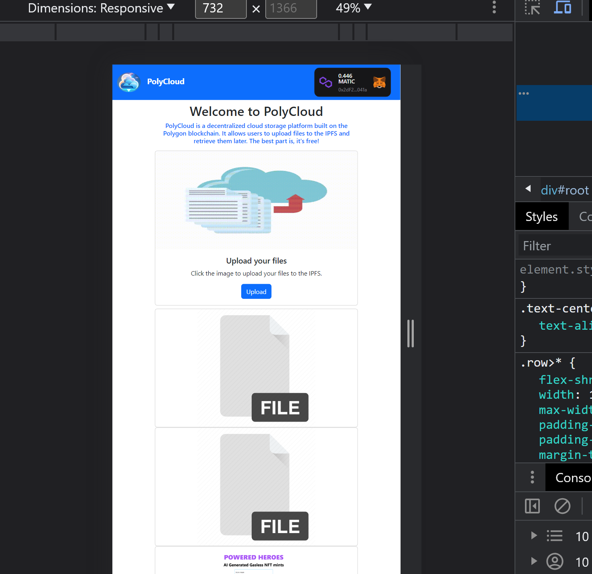

# PolyCloud
Deployed at:- https://polycloud.vercel.app/
Video Demo:- https://youtu.be/Adh9l1aLv_o

## Introduction
PolyCloud is a decentralized cloud storage platform that allows users to store their files on the blockchain. The platform is built on the Ethereum blockchain and uses the InterPlanetary File System (IPFS) to store the files. The platform is built using React and Solidity along with ThirdWeb.

## Installation
    step 1: git clone
    step 2: cd PolyCloud
    step 3: npm install
    step 4: npm dev

## Tech Stack Used
 This project is built using the following tech stack:
    - React
    - React-Bootstrap
    - ThirdWeb
    - Solidity
    - Remix IDE
    - 

## Image of the Project

# About the Developer

Hello everyone, myself **Mohammad Ayaan Siddiqui** from India. I am a Full Stack WEB3 developer and a **DECENTRALIZATION MAXI**. I talk about WEB3, Cryptocurrencies, Javascript and Python and currently learning web3.

**Currently Learning and Building in React.js, Next.js, Solidity, Golang, Hardhat, Ethers.js, React Native, Tailwind, Html, CSS, Python, etc.**

If you are interested in either of the topics or building in similar skills, connect with me below:-

1.  [My Linktree with ALL SOCIALS](https://linktr.ee/ayaaneth)
2.  [Connect on Github](https://github.com/moayaan1911)
3.  [Connect on Linkedin](www.linkedin.com/in/ayaaneth)
4.  [Connect on Twitter](https://www.twitter.com/usdisshitcoin)
5.  [Connect on Telegram](https://t.me/usdisshitcoin)
6.  [Connect on dev.to](https://dev.to/moayaan1911)